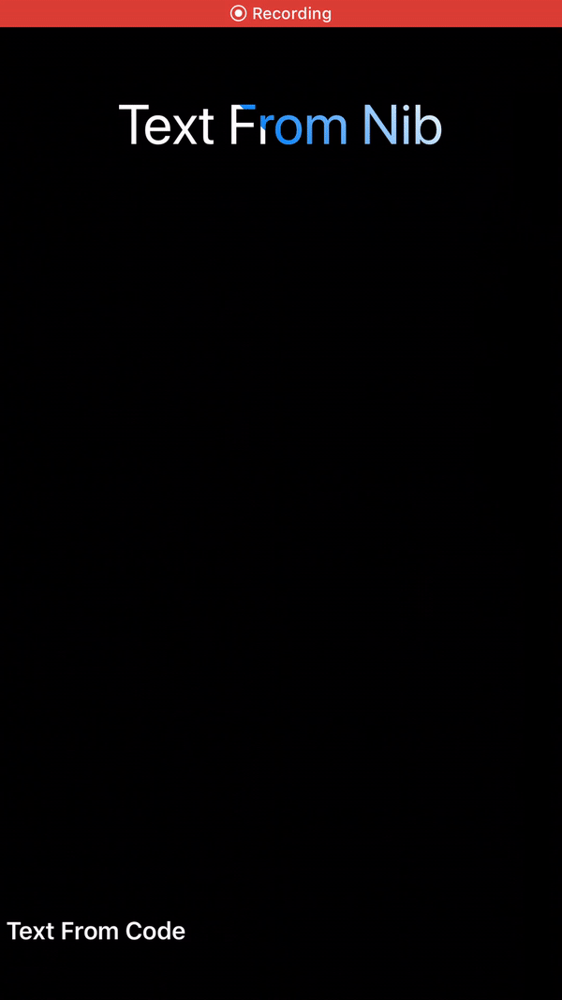

# ShimmerLabel



```swift
		let label = ShimmerLabel()
		label.text = " Text From Code"
		label.font = UIFont.boldSystemFont(ofSize: 18)
		
		label.translatesAutoresizingMaskIntoConstraints = false
		label.shimmerColor = .red
		self.view.addSubview(label)
		
		label.centerXAnchor.constraint(equalTo: self.view.centerXAnchor).isActive = true
		label.leadingAnchor.constraint(equalTo: self.view.leadingAnchor).isActive = true
		label.trailingAnchor.constraint(equalTo: self.view.trailingAnchor).isActive = true
		label.bottomAnchor.constraint(equalTo: self.view.bottomAnchor, constant: -40).isActive = true
```
